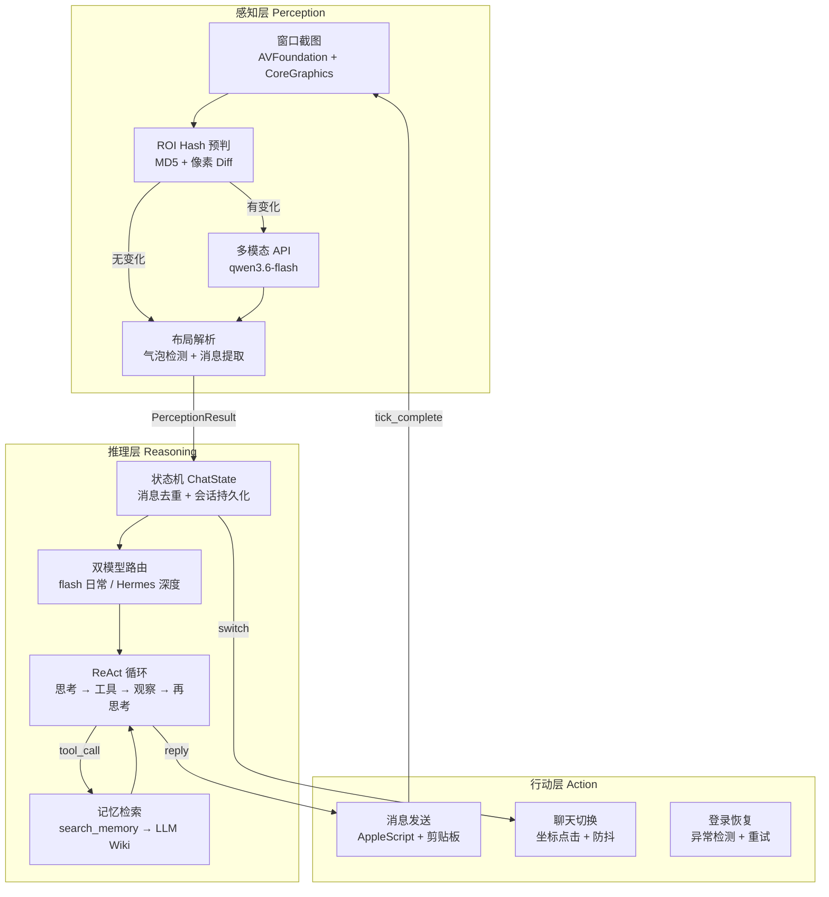
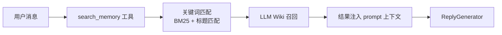

# WeChat Mac RPA

基于多模态视觉感知与 LLM Agent 的 macOS 微信自动化框架。

**不是协议逆向，不是 Hook，不碰微信数据库。** 我们把微信当作黑盒 GUI 应用，用计算机视觉读取界面，用大语言模型理解对话，用系统级自动化操作界面。微信更新 UI 只是换了一套视觉输入，不需要追着协议跑。

---

## 系统架构



Bot 的核心是一个**认知循环**：每 5 秒对微信窗口做一次快照，感知层提取当前对话状态，推理层决定如何回复，行动层执行界面操作。三个层之间通过严格的数据契约（`PerceptionResult`、`ChatState`、`ActionResult`）通信，底层细节完全隔离。

---

## 认知循环：感知 → 推理 → 行动

### 感知层（Perception）

感知层的任务是**把像素变成结构化数据**。它不"理解"对话，只负责忠实还原界面上的文字、布局和状态。

#### 1. 像素差异预判（ROI Hash）

不是每帧都调 API。我们设计了两级预判：

```
截图 → MD5 全图哈希
    │
    ├── 哈希相同 → 零 API 调用，直接复用上轮 PerceptionResult
    │
    └── 哈希不同 → 计算消息区域像素 diff 比例
            │
            ├── diff < threshold → 本地 LayoutParser 解析聊天列表，消息区置空
            │
            └── diff ≥ threshold → 走 qwen3.6-flash API 识别消息内容
```

**技术细节：**
- **MD5 全图哈希**：文件级比对，截图完全一致时直接跳过（常见场景：无新消息、用户正在打字）
- **消息区域像素 diff**：ROI 区域（`message_region`）逐像素差值，RGB 任一通道差值 > 10 视为变化点。差异比例 = 变化像素数 / 总像素数
- **稳定模式**：连续 3 帧低差异后，阈值临时降低 50%，防止聊天列表轻微滚动导致的反复触发

实测 **92.6% 的 tick 无需调用 API**，感知延迟从 ~2s（全 API）降至 ~200ms（本地跳过）。

#### 2. 多模态 API 兜底

当预判认为"有实质变化"时，截图被编码为 base64，送入 `qwen3.6-flash` 做结构化识别。系统 prompt 包含严格的识别规则：

- 未读角标判定：必须同时满足「红色圆形背景 + 白色数字 + 头像边界外」三个条件
- 输入框过滤：时间戳、"按住说话"、引用回复框不得被识别为消息
- sender 分类：私聊统一为 `"自己"/"对方"`，群聊保留昵称

**为什么是 qwen3.6-flash 而不是本地 OCR？**
本地 OCR（macOS Vision）在群聊场景下准确率约 60%，主要痛点：昵称截断、emoji 丢失、换行格式混乱。多模态模型在相同场景下达到 ~83%，且能识别图片内容（表情包文字、图片中的文字）。

#### 3. 布局解析

`LayoutParser` 负责从截图中提取精确坐标：

- **气泡检测**：基于颜色聚类区分左右气泡（自己发的是绿色/蓝色，对方是白色/灰色）
- **消息边界框**：每个气泡的 `Rect` 坐标，用于点击、滚动、高亮
- **聊天列表坐标**：每个会话条目的位置，用于未读角标定位和点击切换

布局配置（`LayoutProfile`）按微信版本管理，不同版本的坐标系差异通过配置文件隔离。

---

### 推理层（Reasoning）

推理层是 Bot 的"大脑"。它不直接操作界面，只决定"说什么"和"用什么工具"。

#### 1. 状态机：ChatState

每个聊天有独立的状态对象 `ChatState`，包含：

```python
@dataclass
class ChatState:
    chat_id: str
    chat_name: str
    is_group: bool
    messages: List[ChatMessage]        # 完整消息历史
    _msg_ids: set                       # 去重集合（基于内容哈希）
    pending_self_messages: List[...]    # 已发送但未确认的消息
```

**跨 tick 去重**：感知层每 5 秒输出一帧消息列表，但这些消息可能在上一个 tick 已经见过。GlobalStore 使用 **2-gram Jaccard 相似度**做内容去重（阈值 0.85），同时维护 `_msg_ids` 集合做精确去重。这避免了"重复回复同一条消息"的致命错误。

**持久化**：所有 `ChatState` 以 JSON 形式存储在 `data/chat_states/`，Bot 重启后对话上下文不丢失。

#### 2. 双模型路由

单一模型无法同时满足"秒回闲聊"和"深度推理"。ReplyGenerator 内部有一个路由决策：

```
用户输入 + 历史上下文
        │
        ├── 日常闲聊（问候、表情、简单问答）
        │       → deepseek-v4-flash（~800ms，Tool Calling）
        │
        └── 深度任务（股票查询、关系推理、复杂规划）
                → Hermes Agent（长上下文、多轮规划）
```

**不是简单的 if-else**。路由基于 prompt 中的 skill 分类和工具调用历史动态决定。flash 模型处理 90% 的日常对话，Hermes 处理剩余 10% 的复杂场景。两者拥有独立的 system prompt 和工具体系。

#### 3. ReAct 循环（思考 → 行动 → 观察）

ReplyGenerator 是一个完整的 **ReAct Agent 运行时**：

```
用户输入
    │
    ▼
[思考] LLM 分析意图，决定是否需要工具
    │
    ├── 无需工具 → 直接生成回复
    │
    └── 需要工具 → 输出 tool_call（如 search_memory）
            │
            ▼
        [行动] 执行工具，获取结果
            │
            ▼
        [观察] 工具结果注入上下文
            │
            ▼
        [再思考] LLM 基于新信息重新推理
            │
            └── 可能需要更多工具 → 循环继续
            └── 信息充分 → 生成最终回复
```

**技术细节：**
- 多轮工具调用上限：5 轮，防止无限循环
- 超时保护：单轮 LLM 调用 30s，整条链路 120s
- 空回复自动重试：模型返回空字符串时，自动附加 "请给出具体回复" 重试一次
- 跨 tick 工具缓存：`SessionMemory` 缓存同一对话内的工具结果，避免重复查询

#### 4. 记忆检索（LLM Wiki）

Bot 不是无状态聊天机器人。每个联系人、群聊、话题都有独立的 **Wiki**（Markdown 格式），由 LLM 自动维护、人工可覆写。



**Wiki 结构：**
- 自动构建：从聊天历史提取实体、关系、偏好，生成结构化 Markdown
- Overrides：人工可覆写任意字段，LLM 更新时自动保护（`# OVERRIDE` 标记）
- 增量更新铁律：严禁删除现有内容，所有事实标注来源（`（来源：某群/某人提及/日期）`）
- 召回率：96.6%（29 个 benchmark cases）

**隐私优先**：所有数据本地存储（`data/memory/wiki/`），不上传云端。

---

### 行动层（Action）

行动层负责**把文本变成界面操作**。它面对的是不稳定的 GUI 环境：窗口可能被遮挡、焦点可能丢失、剪贴板可能被其他应用污染。

#### 1. 消息发送的原子操作链

```
激活 WeChat 窗口
    ↓
确保 frontmost（验证当前激活应用名）
    ↓
文本写入剪贴板（pbcopy）
    ↓
模拟粘贴（⌘+V）
    ↓
模拟回车发送
    ↓
剪贴板验证（读取确认内容正确）
    ↓
成功 / 失败 → 重试（最多 3 次）
```

**安全机制：**
- **frontmost 验证**：粘贴前确认 WeChat 是 frontmost 进程，防止消息发到其他应用
- **异常内容熔断**：verify 读到的内容长度超过预期 3 倍时立即中止，防止误删/误发其他窗口内容
- **每次重试从头开始**：重新激活 + focus + pbcopy，避免窗口焦点丢失后后续重试白给

#### 2. 聊天列表切换

Bot 需要遍历未读聊天列表，逐个处理。切换流程：

```
获取目标聊天在列表中的坐标
    ↓
点击坐标（AppleScript 模拟鼠标）
    ↓
等待 300ms（界面渲染）
    ↓
截图验证当前聊天名是否匹配
    ↓
不匹配 → 重试 / 标记为失败
```

**防抖**：10 秒内不重复切换同一个目标，避免高频切换导致的界面卡顿。

#### 3. 登录恢复

Bot 长期运行可能遇到微信掉线。`WeChatLoginHandler` 监控异常模式：
- 窗口标题变为 "登录"
- 截图内容出现二维码
- 连续 N 次感知失败

触发后进入恢复流程：扫码提醒 → 等待登录 → 验证恢复 → 继续主循环。

---

## 分层架构（L1-L5）

```
L5  Bot Orchestrator        ← 主循环编排：感知 → 会话 → 决策 → 生成 → 行动
L4  Session / Reply / Action ← 去重、决策、生成、发送
L3.5 SmartPerceptionPipeline ← 像素差异预判 + qwen3.6-flash API 兜底
L3  Layout / Message         ← 布局解析、消息提取
L2  OCR / Capture / Profile  ← Vision 文字识别、窗口截图、布局配置
L1  Domain Models            ← Point, Rect, ChatMessage, PerceptionResult
```

每层只向下依赖。Bot 层只消费 `PerceptionResult` 和 `ChatMessage`，不直接接触 OCR、截图或布局解析。这种隔离使得替换感知层（如从 OCR 切换到数据库驱动）不需要修改上层代码。

---

## 工程体系

> 这不是一个玩具项目。我们建立了完整的工程闭环：Badcase 发现 → Benchmark 量化 → 根因分析 → 通用规则修复 → 回归验证。

### Benchmark 驱动开发

**5 个独立 benchmark，136 个 case，覆盖核心链路：**

| Benchmark | Cases | 评估方式 | 当前状态 |
|-----------|-------|---------|---------|
| **Reply Quality** | 24 | LLM-as-a-Judge + 18 个自定义 Rubric | ✅ 100% |
| **Tool Decision** | 27 | Binary + Judge Rubric（对抗性 case） | 🟡 81.5% |
| **Memory Search** | 29 | Precision/Recall/F1 | 🟡 96.6% |
| **Chat List Unread** | 23 | Precision/Recall | ✅ 100% |
| **OCR Quality** | 33 | Sender/Text/ChatName/Count | 🔴 24.2% |

**评估基础设施：**
- **LLM-as-a-Judge**：Reply Quality 和 Tool Decision 对抗性 case 使用 `deepseek-v4-pro` 做结构化 Rubric 评估（非关键词匹配）
- **缓存机制**：Judge 结果按内容哈希缓存（`judge_{hash}.json`），支持快速回归
- **pytest 集成**：所有 benchmark 可直接用 `pytest -v` 运行，CI 友好

**开发铁律：** 任何 prompt 修改、模型切换、感知层逻辑变更，必须先跑 benchmark 验证，禁止直接上生产。

### Badcase 闭环

```
生产 tick → case_generator.py 提取异常 → judge_worker.py 自动评估
                                               ↓
                                    review_server.py 人工审核
                                               ↓
                                    加入 benchmark → 根因分析
                                               ↓
                                    通用规则修复 → benchmark 回归验证
                                               ↓
                                    通过 → 上生产
```

生产环境中的每一条异常 tick 都被自动捕获、评估、归档。不是"修完就忘"，而是形成可追溯、可回归的 case 资产。

### 全链路 Profile 监控

**不是"感觉慢"，而是数据驱动。**

整个链路已植入统一的 `[Perf]` 打点：

```
[Perf][Capture] total=650ms find_window=120ms screenshot=380ms validate=150ms
[Perf][OCR] recognize: 1200ms, elements=47
[Perf][Layout] parse: 580ms bubbles=420ms chat_list=160ms
[Perf][Generate] total=7200ms sp=80ms tc=120ms up=1800ms route=2200ms llm=2800ms parse=200ms
[Perf][Memory] self=45ms other=380ms group=120ms mentions=850ms
[Perf][Sender] total=3200ms read_clipboard=15ms activate=200ms pbcopy=80ms ...
```

基于日志数据驱动，我们编写了 `PERFORMANCE_SPEC.md`（`docs/02-architecture/specs/PERFORMANCE_SPEC.md`），包含：
- 各阶段耗时基线（无消息 tick ~3s，完整链路 ~18s）
- 瓶颈分解与优先级排序
- 优化方案设计（hash 缓存、skill 缓存、memory 读缓存等）
- A/B 测试指标定义

---

## 快速开始

### 环境

- macOS 12+
- Python 3.10+
- 微信 Mac 版（推荐 4.1.8）

### 安装

```bash
git clone <repo>
cd wechat-mac-rpa
pip install -r requirements.txt
```

### 配置

```bash
# API Key（感知层 + LLM 调用）
export DASHSCOPE_API_KEY=your_key

# 可选：Kimi 本地代理（回复生成）
export OPENCLAW_API_KEY=your_key

# 可选：启用 WeFlow 数据库驱动感知（实验性）
export WEFLOW_MODE=weflow
```

### 启动

```bash
# 生产环境
python3 run_bot.py

# 指定配置
USE_MULTIMODAL_OCR=false python3 run_bot.py   # 纯本地 OCR 模式
```

### 测试

```bash
# 全量 benchmark 回归（使用缓存）
python3 -m pytest src/tests/test_ocr_quality_benchmark.py -v
python3 -m pytest src/tests/test_reply_quality_benchmark.py -v
python3 -m pytest src/tests/test_tool_decision_benchmark.py -v
python3 -m pytest src/tests/test_memory_search_benchmark.py -v
python3 -m pytest src/tests/test_chat_list_unread_benchmark.py -v

# 真实 API（更新缓存）
python3 -m pytest src/tests/test_reply_quality_benchmark.py -v --run-api
```

---

## 项目结构

```
wechat-mac-rpa/
├── src/
│   ├── bot/wechat_bot.py              # L5: 主循环编排
│   ├── perception/
│   │   ├── smart_pipeline.py          # L3.5: 智能感知（本地预判 + API 兜底）
│   │   ├── vision_pipeline.py         # L3.5: 纯本地 OCR 备用管道
│   │   ├── weflow_pipeline.py         # L3.5: 数据库驱动感知（实验性）
│   │   └── weflow_client.py           # L3.5: WeFlow 客户端
│   ├── layout/
│   │   ├── layout_parser.py           # L3: 布局解析
│   │   └── profile.py                 # L2: 布局配置
│   ├── message/extractor.py           # L3: 消息提取
│   ├── session/global_store.py        # L4: 全局消息存储（LCS 去重 + 持久化）
│   ├── reply/
│   │   ├── generator.py               # L4: 回复生成（Agent 运行时 + 双模型路由）
│   │   ├── policy.py                  # L4: 回复决策
│   │   └── session_memory.py          # L4: 跨 tick 工具缓存
│   ├── memory/engine.py               # L4: 长期记忆（LLM Wiki + Overrides）
│   ├── tools/                         # L4: 工具注册 + 内置工具
│   ├── action/
│   │   ├── message_sender.py          # L4: 消息发送
│   │   ├── chat_list_clicker.py       # L4: 聊天列表切换
│   │   └── login_recovery.py          # L4: 登录恢复
│   ├── capture/window_capture.py      # L2: 窗口截图
│   ├── ocr/vision_ocr.py              # L2: macOS Vision 文字识别
│   ├── models/base.py                 # L1: 领域模型
│   ├── llm/
│   │   ├── openclaw_client.py         # LLM 客户端（Kimi 本地代理）
│   │   └── qwen_client.py             # LLM 客户端（DashScope API）
│   ├── utils/                         # L1-L5 共享工具
│   ├── badcase/                       # Badcase 闭环体系
│   │   ├── case_generator.py          # 从 tick 数据生成 benchmark case
│   │   ├── judge_worker.py            # 异步 Judge LLM 评估
│   │   └── review_server.py           # 人工审核 Web 服务
│   └── tests/
│       ├── test_ocr_quality_benchmark.py        # 33 cases
│       ├── test_reply_quality_benchmark.py      # 24 cases
│       ├── test_tool_decision_benchmark.py      # 27 cases
│       ├── test_memory_search_benchmark.py      # 29 cases
│       ├── test_chat_list_unread_benchmark.py   # 23 cases
│       └── ...                          # 单元测试
├── docs/
│   ├── 01-quickstart/                   # 快速开始
│   ├── 02-architecture/                 # 架构设计 + API 接口 + 模块索引
│   │   ├── ARCHITECTURE.md
│   │   ├── API_SURFACE.md              # 公共接口速查表
│   │   ├── MODULE_INDEX.md             # 按问题/文件索引
│   │   ├── CODING_PRINCIPLES.md
│   │   └── specs/                      # 各模块 SPEC
│   ├── 03-guides/                       # 使用指南 + 项目状态
│   ├── 04-troubleshooting/              # 问题排查 + 经验教训
│   └── 05-meta/                         # 实验记录 + 审计
├── data/
│   ├── debug/                           # tick 级 debug JSON
│   ├── memory/wiki/                     # 用户/群聊/话题 wiki
│   └── screenshots/                     # 截图存档
└── run_bot.py                           # 生产环境入口
```

---

## 更多文档

| 文档 | 说明 |
|------|------|
| [架构设计](docs/02-architecture/ARCHITECTURE.md) | L1-L5 分层架构、依赖规则、边界约束 |
| [API 接口速查](docs/02-architecture/API_SURFACE.md) | 当前生产代码的公共接口，可直接复制粘贴 |
| [模块索引](docs/02-architecture/MODULE_INDEX.md) | "消息识别错了"→改哪个文件 |
| [编码原则](docs/02-architecture/CODING_PRINCIPLES.md) | 类型注解、单一职责、单向依赖 |
| [项目进度](docs/03-guides/PROJECT_STATUS.md) | 当前状态、活跃问题、benchmark 结果 |
| [性能优化 Spec](docs/02-architecture/specs/PERFORMANCE_SPEC.md) | 全链路 profiling 点、瓶颈分析、优化方案 |
| [踩坑记录](docs/04-troubleshooting/LESSONS_LEARNED.md) | 历史教训、常见错误模式 |

---

## 免责声明

本项目仅用于个人学习和研究目的。使用自动化工具操作微信可能违反微信用户协议，请自行评估风险。本项目作者不对任何使用后果负责。
