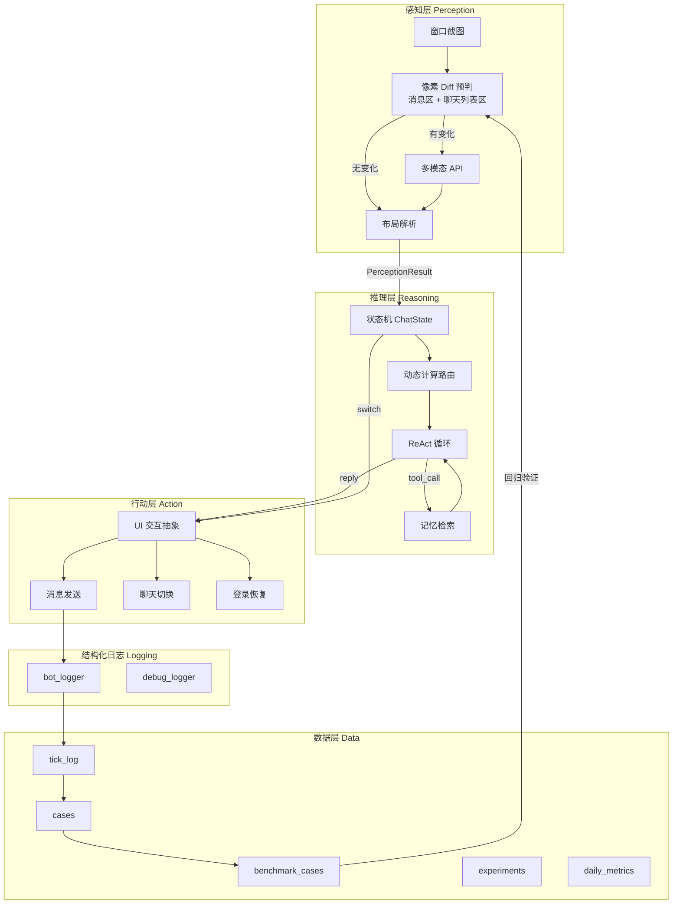
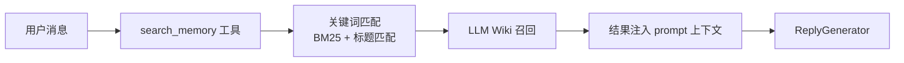
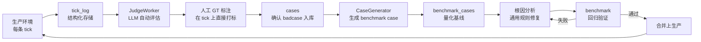

# WeChat Mac RPA

基于多模态视觉感知与 LLM Agent 的 macOS 微信自动化框架。

**不是协议逆向，不是 Hook，不碰微信数据库。** 我们把微信当作黑盒 GUI 应用，用计算机视觉读取界面，用大语言模型理解对话，用系统级自动化操作界面。微信更新 UI 只是换了一套视觉输入，不需要追着协议跑。

---

## 系统架构



Bot 的核心是一个**认知循环**：定期对微信窗口做快照，感知层提取当前对话状态，推理层决定如何回复，行动层执行界面操作。三个层之间通过严格的数据契约（`PerceptionResult`、`ChatState`、`ActionResult`）通信，底层细节完全隔离。

每一次认知循环的完整链路（截图 → 感知 → 去重 → 决策 → 回复 → 发送）都被结构化日志逐条记录到 `tick_log`，为后续的质量审计与数据飞轮提供原始素材。

---

## 认知循环：感知 → 推理 → 行动

### 感知层（Perception）

感知层的任务是**把像素变成结构化数据**。它不"理解"对话，只负责忠实还原界面上的文字、布局和状态。

当前有三条感知管道：

- **SmartPipeline**（主力）：本地预判 + 多模态 API 兜底。先用像素 Diff 判断截图是否有实质变化，无变化时零 API 调用直接跳过；有变化时调用多模态大模型提取消息内容，同时用本地 OCR 做几何定位。
- **VisionPipeline**（Fallback）：纯本地 OCR 备用管道，在多模态 API 不可用时降级运行。
- **WeFlowPipeline**（实验性）：直接读取 WeChat 数据库驱动感知，启动时用于历史注入，运行时可辅助未读检测。

#### 多模态视觉理解

传统 OCR 方案在微信这类高度定制 UI 的应用上存在结构性脆弱：硬编码的锚点规则在每次 UI 更新后都需要重写，emoji 与图片内容完全丢失，群聊昵称截断后无法还原。

我们用**多模态大模型**直接阅读截图并输出结构化数据。模型通过视觉理解界面语义，而不是依赖硬编码坐标规则——微信升级后只需调整识别规则的文本描述，不需要改动任何代码。布局理解（气泡对齐方向、sender 归属）由模型直接判断，准确率显著高于基于颜色或坐标的启发式规则。

#### 两级预判与混合定位

不是每帧都调多模态 API。我们设计了两级预判：

- **全图哈希比对**：截图与上轮完全相同时，直接复用上轮结果，零 API 调用。
- **分区像素 Diff**：消息区与聊天列表区任一区域有实质变化时，才触发多模态 API；两区域均静止时本地跳过。

多模态模型负责语义理解，本地 OCR 负责几何定位（精确坐标输出），LayoutParser 将两者融合。这种分工让各自做擅长的事。

---

### 推理层（Reasoning）

推理层是 Bot 的"大脑"。它不直接操作界面，只决定"说什么"和"用什么工具"。

#### LCS 序列对齐：跨 tick 消息去重

感知层以固定间隔输出一帧消息列表，但聊天历史不会消失——大部分消息在上一轮已经见过。如果 Bot 把旧消息当成新消息，就会重复回复。

我们用 **LCS（最长公共子序列）**做跨 tick 消息对齐，对齐基于多维度模糊匹配：精确哈希匹配、文字相似度、图片 2-gram Jaccard 相似度。对齐后只有真正的新消息进入后续流程，旧消息被静默丢弃。这解决了"重复回复"这个致命错误。

#### 动态计算路由

ReplyGenerator 内部有一个二级路由决策：先用轻量调用判断用户意图是否匹配某个复杂 Skill，再决定后续投入多少计算资源。

- **日常路径**：绝大多数闲聊、问候、简单问答走超轻量单轮生成，不加载 Skill，不启用工具调用。
- **深度路径**：匹配到复杂 Skill 时，切换长上下文模型，加载 Skill 正文，启用完整工具链。

这种"先轻量判断、再决定投入"的设计，让大部分日常对话保持毫秒级响应，只有复杂任务才走重型路径。Skills 是可插拔的 Markdown 文件，新增一个 Skill 只需要丢一个文件进目录，零代码改动。

#### ReAct 工具循环

当进入日常路径且需要外部信息时，ReplyGenerator 运行完整的 **ReAct 循环**：

```
[思考] 分析意图 → [行动] 调用工具 → [观察] 注入结果 → [再思考] 重新推理
```

循环内置防失控机制：工具调用有轮次上限，单条链路有超时保护，同一对话内的工具结果会被缓存避免重复查询。

#### 记忆系统（LLM Wiki）

Bot 不是无状态聊天机器人。每个联系人、群聊都有独立的 **Wiki**（Markdown 格式），通过 `search_memory` 工具在对话中实时召回。



**全量构建**：从存量聊天记录批量生成 wiki，按全局用户索引聚合跨聊天消息，自动发现别名，分轮次增量构建。Bot 上线时即可拥有完整背景知识，不需要从零积累。

**增量构建**：运行中新对话被后台异步队列消费，LLM 接收「现有 wiki + 新对话」，输出更新后的完整 wiki。所有新增事实标注来源，严禁删除现有内容。

**人工 Overrides**：通过外挂 JSON 实现任意字段覆写，LLM 更新时不会破坏人工修改。

所有数据本地存储，不上传云端。

---

### 行动层（Action）

行动层负责**把文本变成界面操作**。它面对的是不稳定的 GUI 环境：窗口可能被遮挡、焦点可能丢失、剪贴板可能被其他应用污染。

我们用 **UIInteractor** 抽象所有坐标级交互（点击聊天列表项、聚焦输入框），上层 Action（消息发送、聊天切换）基于该抽象实现，便于替换底层自动化方案。

消息发送是一个原子操作链：激活窗口 → 验证 frontmost → 写入剪贴板 → 模拟粘贴 → 模拟回车 → 剪贴板验证。安全机制包括：粘贴前确认 WeChat 是 frontmost 进程（防止消息发到其他应用）、异常内容熔断、每次重试从头开始。

Bot 每个 tick 检测并切换到未读数最高的聊天逐个处理：获取目标坐标 → 点击 → 等待渲染 → 截图验证。同一目标在短时间内不会重复切换，避免高频切换导致的界面卡顿。

长期运行可能遇到微信掉线。LoginHandler 监控异常模式（窗口标题变为登录、截图出现二维码、连续感知失败），触发后进入恢复流程：扫码提醒 → 等待登录 → 验证恢复 → 继续主循环。

---

## 数据飞轮：生产质量闭环

> Bot 上线不是终点，而是数据积累的开始。



与传统"散落 JSON + 手动归档"不同，我们的闭环以 **SQLite 数据库**为核心：

1. **tick_log**：每条认知循环的完整链路（截图、prompt、回复、工具调用、耗时）自动入库
2. **JudgeWorker 自动评估**：后台线程消费 tick_log，按结构化 Rubric 打分，判断是否为 badcase，结果写回 tick_log
3. **人工 GT 标注**：开发者在后台对 tick 直接打标（`human_is_badcase`、`human_badcase_type`），修正 Judge 的误判
4. **cases 入库**：确认的 badcase 进入 cases 表，保存完整对话、prompt、评分维度、工具调用链
5. **CaseGenerator**：从 cases 自动生成 benchmark case 代码，直接插入对应测试模块
6. **量化基线**：新 case 加入 benchmark，成为回归测试的一部分
7. **通用规则修复**：禁止 case-by-case 的 prompt 补丁，必须从根因出发写通用规则
8. **回归验证**：修复后跑全量 benchmark，全部通过才能上生产

生产环境中的每一条异常都被自动捕获、评估、归档。不是"修完就忘"，而是形成**可追溯、可回归的 case 资产**。随着 case 库的增长，Bot 的鲁棒性持续提升。

---

## 工程体系

### Benchmark 驱动开发

**任何 prompt 修改、模型切换、感知层逻辑变更，必须先跑 benchmark 验证，禁止直接上生产。**

现有 8 个独立 benchmark，覆盖核心链路：

| Benchmark | Cases | 评估方式 | 当前状态 |
|-----------|-------|---------|---------|
| **Reply Quality** | 24 | LLM-as-a-Judge + 自定义 Rubric | ✅ 100% |
| **Reply Stability** | — | 多轮重复一致性检验 | — |
| **Tool Decision** | 27 | Binary + Judge Rubric（对抗性 case） | 🟡 81.5% |
| **Memory Search** | 29 | Precision / Recall / F1 | 🟡 96.6% |
| **Chat List Unread** | 23 | Precision / Recall | ✅ 100% |
| **OCR Quality** | 33 | Sender / Text / ChatName / Count | 🔴 24.2% |
| **Judge Quality** | 18 | Meta-benchmark：评估 Judge LLM 自身准确率 | — |
| **Judge Quality v2** | — | 多维度 Rubric 评估 | — |

开发流程：

```
Badcase → Benchmark 复现 → 根因分析 → 通用规则修复 → Benchmark 回归验证 → 上生产
```

### 多维度评测体系

除了核心链路 benchmark，我们还建立了完整的评测基础设施：

- **Benchmark Dashboard**：自动生成可视化报告，汇总各 benchmark 的历史趋势与当前状态
- **Judge 质量监控**：Meta-benchmark 持续评估 Judge LLM 自身的评判准确率，防止评判标准漂移
- **回复稳定性测试**：同一输入多次运行，检验输出一致性，发现随机性导致的质量回归
- **OCR 质量评测**：多模态识别与本地 OCR 的融合效果量化评估

### 实验框架

支持 A/B 实验与参数调优：`scripts/run_experiment.py` 提供标准化的实验运行环境，支持对比不同 prompt、模型、路由策略的效果，实验结果自动归档到 `data/experiments/`。

### 管理后台

内置 FastAPI 开发者后台（`scripts/admin.py`），提供：

- **Dashboard**：实时查看今日 Tick 数、回复数、平均 Judge 分、跳过率
- **Tick 查看**：逐条浏览生产环境的感知-决策-回复全链路记录
- **人工标注**：对 Judge 判定结果进行人工确认与分类（GT 标注直接打在 tick 上）
- **截图 OCR**：可视化验证多模态识别与本地 OCR 的融合效果
- **Benchmark 报告**：Judge 质量、回复质量的多维度可视化
- **实验管理**：查看历史实验记录与对比结果

### 全链路 Profile 监控

整个链路植入统一的性能打点，覆盖截图、OCR、布局、生成、记忆、发送各阶段。基于日志数据驱动优化。

---

## 内置工具

工具通过统一注册表管理，新增工具只需实现函数 + 注册，零改动现有代码。

| 工具 | 用途 |
|------|------|
| `get_current_time` | 获取当前日期和时间 |
| `get_weather` | 查询指定城市天气 |
| `web_search` | 网页搜索实时信息 |
| `browse_url` | 提取链接网页正文 |
| `stock_query` | 查询股票实时行情 |
| `search_memory` | 搜索本地 LLM Wiki 记忆库 |

---

## 快速开始

- **环境**：macOS 12+，Python 3.10+，微信 Mac 版
- **配置**：复制 `.env.example` 为 `.env`，填入 API Key
- **启动**：`python3 run_bot.py`
- **后台**：`python3 scripts/admin.py`
- **测试**：`python3 -m pytest src/tests/test_*_benchmark.py -v`

详细安装与配置指南见 `docs/01-quickstart/AI_QUICKSTART.md`。

---

## 项目结构

```
wechat-mac-rpa/
├── src/
│   ├── bot/wechat_bot.py              # L5: 主循环编排
│   ├── perception/
│   │   ├── smart_pipeline.py          # L3.5: 主力感知（本地预判 + API 兜底）
│   │   ├── vision_pipeline.py         # L3.5: 纯本地 OCR 备用管道
│   │   ├── weflow_pipeline.py         # L3.5: 数据库驱动感知（实验性）
│   │   └── weflow_client.py           # L3.5: WeFlow 客户端
│   ├── layout/
│   │   ├── layout_parser.py           # L3: 布局解析
│   │   └── profile.py                 # L2: 布局配置
│   ├── message/extractor.py           # L3: 消息提取
│   ├── session/global_store.py        # L4: 全局消息存储（LCS 去重 + 持久化）
│   ├── reply/
│   │   ├── generator.py               # L4: 回复生成（Agent 运行时 + 双模型路由）
│   │   ├── policy.py                  # L4: 回复决策
│   │   └── session_memory.py          # L4: 跨 tick 工具缓存
│   ├── memory/engine.py               # L4: 长期记忆（LLM Wiki + Overrides）
│   ├── tools/                         # L4: 工具注册 + 内置工具
│   │   ├── tool_registry.py
│   │   ├── builtin_tools.py
│   │   └── stock_tools.py
│   ├── action/
│   │   ├── ui_interactor.py           # L4: UI 交互抽象（点击 / 聚焦）
│   │   ├── message_sender.py          # L4: 消息发送（基于 ui_interactor）
│   │   ├── chat_list_clicker.py       # L4: 聊天列表切换（基于 ui_interactor）
│   │   └── login_recovery.py          # L4: 登录恢复
│   ├── capture/window_capture.py      # L2: 窗口截图
│   ├── ocr/vision_ocr.py              # L2: macOS Vision 文字识别
│   ├── models/base.py                 # L1: 领域模型
│   ├── llm/
│   │   ├── openclaw_client.py         # LLM 客户端（Kimi 本地代理）
│   │   └── qwen_client.py             # LLM 客户端（DashScope API）
│   ├── logging/bot_logger.py          # 结构化日志与全链路追踪
│   ├── utils/                         # L1-L5 共享工具
│   │   ├── chat_utils.py
│   │   ├── debug_logger.py
│   │   ├── llm_client.py
│   │   ├── qwen_client.py
│   │   ├── text_utils.py
│   │   └── xml_utils.py
│   ├── badcase/                       # Badcase 闭环体系
│   │   ├── case_db.py                 # Case 数据库（tick_log / cases / experiments）
│   │   ├── case_generator.py          # 从 cases 生成 benchmark case 代码
│   │   ├── judge_worker.py            # 异步 Judge LLM 评估
│   │   └── review_server.py           # 人工审核 Web 服务
│   └── tests/                         # Benchmark 套件 + 单元测试
│       ├── test_ocr_quality_benchmark.py
│       ├── test_reply_quality_benchmark.py
│       ├── test_reply_quality_benchmark_v2.py
│       ├── test_reply_stability_benchmark.py
│       ├── test_tool_decision_benchmark.py
│       ├── test_memory_search_benchmark.py
│       ├── test_chat_list_unread_benchmark.py
│       ├── test_judge_quality_benchmark.py
│       ├── test_judge_quality_benchmark_v2.py
│       └── ...
├── scripts/
│   ├── admin.py                       # FastAPI 统一开发者后台
│   ├── generate_benchmark_dashboard.py # Benchmark 报告生成
│   ├── generate_dashboard.py          # 旧版 Dashboard 生成
│   ├── run_experiment.py              # A/B 实验框架
│   ├── run_daily_benchmark.py         # 每日定时 benchmark
│   ├── monitor_benchmark.py           # Benchmark 趋势监控
│   ├── migrate_benchmarks_to_db.py    # Benchmark 数据迁移
│   ├── bulk_import_from_chats.py      # Wiki 逆向初始化
│   └── ...
├── docs/
│   ├── 01-quickstart/                   # 快速开始
│   ├── 02-architecture/                 # 架构设计 + API 接口 + 模块索引
│   │   ├── ARCHITECTURE.md
│   │   ├── API_SURFACE.md
│   │   ├── MODULE_INDEX.md
│   │   ├── CODING_PRINCIPLES.md
│   │   └── specs/                       # 各模块 SPEC
│   ├── 03-guides/                       # 使用指南 + 项目状态
│   ├── 04-troubleshooting/              # 问题排查 + 经验教训
│   └── 05-meta/                         # 实验记录 + 审计
├── data/
│   ├── debug/                           # tick 级 debug JSON
│   ├── logs/                            # 运行日志
│   ├── screenshots/                     # 截图存档
│   ├── memory/wiki/                     # 用户/群聊/话题 wiki
│   ├── benchmark_history/               # Benchmark 历史数据
│   ├── experiments/                     # 实验结果归档
│   └── cases.db                         # Badcase 核心数据库
└── run_bot.py                           # 生产环境入口
```

---

## 更多文档

| 文档 | 说明 |
|------|------|
| [架构设计](docs/02-architecture/ARCHITECTURE.md) | L1-L5 分层架构、依赖规则、边界约束 |
| [API 接口速查](docs/02-architecture/API_SURFACE.md) | 当前生产代码的公共接口，可直接复制粘贴 |
| [模块索引](docs/02-architecture/MODULE_INDEX.md) | "消息识别错了"→改哪个文件 |
| [编码原则](docs/02-architecture/CODING_PRINCIPLES.md) | 类型注解、单一职责、单向依赖 |
| [项目进度](docs/03-guides/PROJECT_STATUS.md) | 当前状态、活跃问题、benchmark 结果 |
| [性能优化 Spec](docs/02-architecture/specs/PERFORMANCE_SPEC.md) | 全链路 profiling 点、瓶颈分析、优化方案 |
| [踩坑记录](docs/04-troubleshooting/LESSONS_LEARNED.md) | 历史教训、常见错误模式 |

---

## 免责声明

本项目仅用于个人学习和研究目的。使用自动化工具操作微信可能违反微信用户协议，请自行评估风险。本项目作者不对任何使用后果负责。
