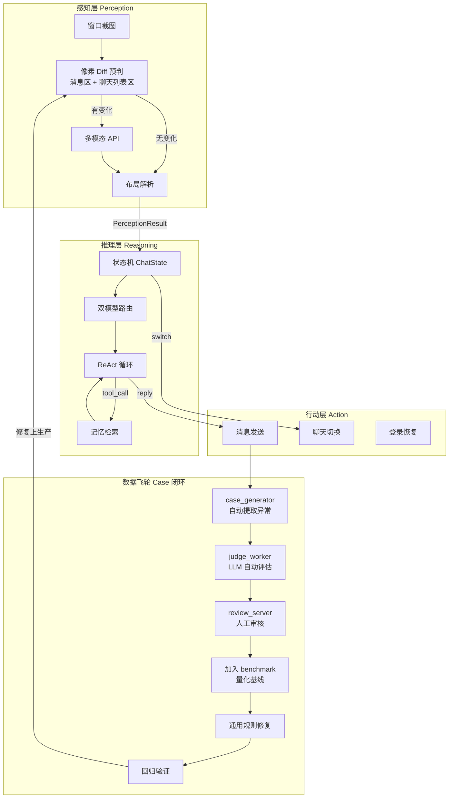
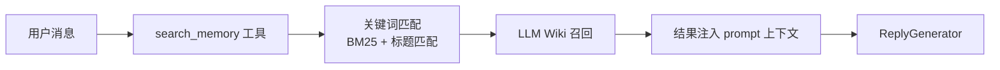
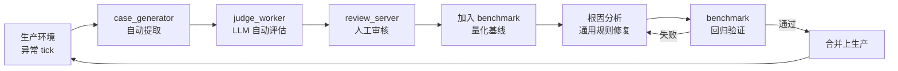
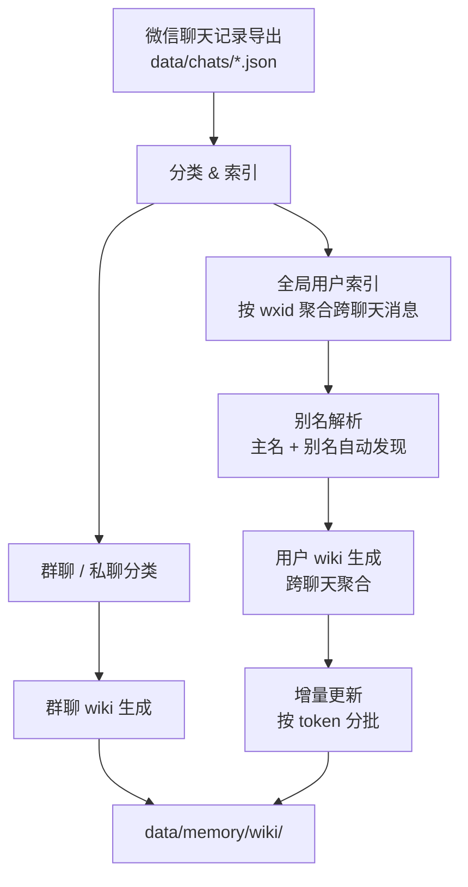

# WeChat Mac RPA

基于多模态视觉感知与 LLM Agent 的 macOS 微信自动化框架。

**不是协议逆向，不是 Hook，不碰微信数据库。** 我们把微信当作黑盒 GUI 应用，用计算机视觉读取界面，用大语言模型理解对话，用系统级自动化操作界面。微信更新 UI 只是换了一套视觉输入，不需要追着协议跑。

---

## 系统架构



Bot 的核心是一个**认知循环**：定期对微信窗口做快照，感知层提取当前对话状态，推理层决定如何回复，行动层执行界面操作。三个层之间通过严格的数据契约（`PerceptionResult`、`ChatState`、`ActionResult`）通信，底层细节完全隔离。

感知层的预判同时监控**消息区域**和**聊天列表区域**：任一区域有实质变化即触发多模态 API，两区域均静止时才本地跳过。这确保其他聊天的新未读不会被漏掉。

---

## 认知循环：感知 → 推理 → 行动

### 感知层（Perception）

感知层的任务是**把像素变成结构化数据**。它不"理解"对话，只负责忠实还原界面上的文字、布局和状态。

不是每帧都调 API。我们设计了两级预判：**全图哈希比对** → **消息区 + 聊天列表区像素 diff** → **两区域均无变化才本地跳过，任一区域有变化即走多模态 API**。

绝大多数 tick 截图没有实质变化——无新消息、用户正在打字、界面静止。此时直接复用上轮结果，**零 API 调用**，感知延迟从秒级降至毫秒级。

当预判认为"有实质变化"时，截图被编码送入 `qwen3.6-flash` 做结构化识别，同时本地 LayoutParser 提取精确坐标（气泡边界框、聊天列表位置）。多模态模型对群聊昵称、emoji、换行格式的识别准确率远高于本地 OCR，且能识别图片和表情包中的文字内容。

布局配置按微信版本管理，不同版本的坐标系差异通过配置文件隔离，升级微信时只需更新配置，无需改代码。

---

### 推理层（Reasoning）

推理层是 Bot 的"大脑"。它不直接操作界面，只决定"说什么"和"用什么工具"。

#### 状态机：ChatState

每个聊天有独立的状态对象，包含完整消息历史、去重集合、已发送但未确认的消息。感知层定期输出一帧消息列表，但这些消息可能在上一个 tick 已经见过。GlobalStore 使用 **Jaccard 相似度**做内容去重，同时维护精确去重集合，避免"重复回复同一条消息"的致命错误。所有状态以 JSON 形式本地持久化，Bot 重启后对话上下文不丢失。

#### 双模型路由

单一模型无法同时满足"秒回闲聊"和"深度推理"。ReplyGenerator 内部有一个路由决策：

- **日常闲聊**（问候、表情、简单问答）→ `deepseek-v4-flash`（低延迟、Tool Calling）
- **深度任务**（股票查询、关系推理、复杂规划）→ Hermes Agent（长上下文、多轮规划）

路由基于 prompt 中的 skill 分类和工具调用历史**动态决定**，不是简单的 if-else。flash 模型处理绝大多数日常对话，Hermes 处理复杂的深度场景。两者拥有独立的 system prompt 和工具体系。

#### ReAct 循环

ReplyGenerator 是一个完整的 **ReAct Agent 运行时**：

```
用户输入
    │
    ▼
[思考] LLM 分析意图，决定是否需要工具
    │
    ├── 无需工具 → 直接生成回复
    │
    └── 需要工具 → 输出 tool_call（如 search_memory）
            │
            ▼
        [行动] 执行工具，获取结果
            │
            ▼
        [观察] 工具结果注入上下文
            │
            ▼
        [再思考] LLM 基于新信息重新推理
            │
            └── 可能需要更多工具 → 循环继续
            └── 信息充分 → 生成最终回复
```

内置防失控机制：工具调用有轮次上限，单条链路有超时保护，模型返回空回复时自动重试，同一对话内的工具结果会被缓存避免重复查询。

#### 记忆检索（LLM Wiki）

Bot 不是无状态聊天机器人。每个联系人、群聊、话题都有独立的 **Wiki**（Markdown 格式），由 LLM 自动维护、人工可覆写。



- **自动构建**：从聊天历史提取实体、关系、偏好，生成结构化 Markdown
- **Overrides**：人工可覆写任意字段，LLM 更新时自动保护（`# OVERRIDE` 标记）
- **增量更新铁律**：严禁删除现有内容，所有事实标注来源
- **召回率**：96.6%（29 个 benchmark cases）
- **隐私优先**：所有数据本地存储（`data/memory/wiki/`），不上传云端

---

### 行动层（Action）

行动层负责**把文本变成界面操作**。它面对的是不稳定的 GUI 环境：窗口可能被遮挡、焦点可能丢失、剪贴板可能被其他应用污染。

消息发送是一个原子操作链：激活 WeChat 窗口 → 确保 frontmost（验证当前激活应用名）→ 文本写入剪贴板 → 模拟粘贴 → 模拟回车发送 → 剪贴板验证。安全机制包括：粘贴前确认 WeChat 是 frontmost 进程（防止消息发到其他应用）、异常内容熔断、每次重试从头开始。

Bot 遍历未读聊天列表，逐个处理：获取目标聊天坐标 → 点击 → 等待界面渲染 → 截图验证聊天名是否匹配。同一目标在短时间内不会重复切换，避免高频切换导致的界面卡顿。

长期运行可能遇到微信掉线。`WeChatLoginHandler` 监控异常模式（窗口标题变为登录、截图出现二维码、连续感知失败），触发后进入恢复流程：扫码提醒 → 等待登录 → 验证恢复 → 继续主循环。

---

## 数据飞轮：生产 case 收集闭环

> Bot 上线不是终点，而是数据积累的开始。



**闭环流程：**

1. **自动提取**：生产环境中每一条异常 tick（回复质量差、工具误调用、OCR 识别错）都被 `case_generator.py` 自动捕获，生成标准化的 case 文件
2. **自动评估**：`judge_worker.py` 使用 deepseek-v4-pro 对 case 做结构化 Rubric 评估，判断是否为真 badcase
3. **人工审核**：`review_server.py` 提供 Web 界面，人工确认、标注、归档
4. **量化基线**：确认的 case 加入 benchmark，成为回归测试的一部分
5. **通用规则修复**：禁止 case-by-case 的 prompt 补丁。必须从根因出发，写通用规则
6. **回归验证**：修复后跑全量 benchmark，必须全部通过才能上生产

生产环境中的每一条异常都被自动捕获、评估、归档。不是"修完就忘"，而是形成**可追溯、可回归的 case 资产**。随着 case 库的增长，Bot 的鲁棒性持续提升。

---

## 记忆系统逆向初始化

Bot 上线时记忆系统是空的，但这不意味着要从零开始积累。如果你有历史聊天记录（微信导出或 WeFlow 备份），可以**逆向初始化**：从存量对话中批量构建 Wiki。



**流程：**

1. **加载聊天记录**：从 `data/chats/*.json` 加载所有聊天历史
2. **分类**：按消息特征区分群聊和私聊（群聊有多个不同 wxid、名称含"群"等）
3. **全局用户索引**：按 `sender_wxid` 聚合同一个用户在所有聊天中的消息，自动发现别名（出现次数≥3 的昵称）
4. **主名解析**：优先使用已有 aliases.json 中的映射，其次使用消息量最多的昵称，冲突时自动加后缀
5. **分轮次增量更新**：按 token 估算把消息分批（每批不超过模型上下文），从旧到新逐轮更新，每轮复用上一轮生成的 wiki 作为基础

**运行：**

```bash
# 先 dry-run 看统计
python3 scripts/bulk_import_from_chats.py --dry-run

# 生成用户 wiki（跨聊天聚合）
python3 scripts/bulk_import_from_chats.py --users-only --workers 3

# 生成群聊 wiki
python3 scripts/bulk_import_from_chats.py --groups-only --workers 3

# 全部生成
python3 scripts/bulk_import_from_chats.py --workers 3
```

**生成的 wiki 结构：**

```
data/memory/wiki/
├── users/
│   ├── 王芊.md
│   ├── 秋水文章.md
│   └── ...
└── groups/
    ├── ai开发小分队.md
n    └── ...
```

初始化完成后，Bot 上线时就已经拥有完整的背景知识，不需要再从零积累。

---

## 工程体系

### Benchmark 驱动开发

**5 个独立 benchmark，136 个 case，覆盖核心链路：**

| Benchmark | Cases | 评估方式 | 当前状态 |
|-----------|-------|---------|---------|
| **Reply Quality** | 24 | LLM-as-a-Judge + 18 个自定义 Rubric | ✅ 100% |
| **Tool Decision** | 27 | Binary + Judge Rubric（对抗性 case） | 🟡 81.5% |
| **Memory Search** | 29 | Precision/Recall/F1 | 🟡 96.6% |
| **Chat List Unread** | 23 | Precision/Recall | ✅ 100% |
| **OCR Quality** | 33 | Sender/Text/ChatName/Count | 🔴 24.2% |

**开发铁律：** 任何 prompt 修改、模型切换、感知层逻辑变更，必须先跑 benchmark 验证，禁止直接上生产。

### 全链路 Profile 监控

整个链路已植入统一的 `[Perf]` 打点，覆盖截图、OCR、布局、生成、记忆、发送各阶段。基于日志数据驱动优化，详见 `PERFORMANCE_SPEC.md`。

---

## 快速开始

### 环境

- macOS 12+
- Python 3.10+
- 微信 Mac 版（推荐 4.1.8）

### 安装

```bash
git clone <repo>
cd wechat-mac-rpa
pip install -r requirements.txt
```

### 配置

```bash
# API Key（感知层 + LLM 调用）
export DASHSCOPE_API_KEY=your_key

# 可选：Kimi 本地代理（回复生成）
export OPENCLAW_API_KEY=your_key

# 可选：启用 WeFlow 数据库驱动感知（实验性）
export WEFLOW_MODE=weflow
```

### 启动

```bash
# 生产环境
python3 run_bot.py

# 指定配置
USE_MULTIMODAL_OCR=false python3 run_bot.py   # 纯本地 OCR 模式
```

### 测试

```bash
# 全量 benchmark 回归（使用缓存）
python3 -m pytest src/tests/test_ocr_quality_benchmark.py -v
python3 -m pytest src/tests/test_reply_quality_benchmark.py -v
python3 -m pytest src/tests/test_tool_decision_benchmark.py -v
python3 -m pytest src/tests/test_memory_search_benchmark.py -v
python3 -m pytest src/tests/test_chat_list_unread_benchmark.py -v

# 真实 API（更新缓存）
python3 -m pytest src/tests/test_reply_quality_benchmark.py -v --run-api
```

---

## 项目结构

```
wechat-mac-rpa/
├── src/
│   ├── bot/wechat_bot.py              # L5: 主循环编排
│   ├── perception/
│   │   ├── smart_pipeline.py          # L3.5: 智能感知（本地预判 + API 兜底）
│   │   ├── vision_pipeline.py         # L3.5: 纯本地 OCR 备用管道
│   │   ├── weflow_pipeline.py         # L3.5: 数据库驱动感知（实验性）
│   │   └── weflow_client.py           # L3.5: WeFlow 客户端
│   ├── layout/
│   │   ├── layout_parser.py           # L3: 布局解析
│   │   └── profile.py                 # L2: 布局配置
│   ├── message/extractor.py           # L3: 消息提取
│   ├── session/global_store.py        # L4: 全局消息存储（LCS 去重 + 持久化）
│   ├── reply/
│   │   ├── generator.py               # L4: 回复生成（Agent 运行时 + 双模型路由）
│   │   ├── policy.py                  # L4: 回复决策
│   │   └── session_memory.py          # L4: 跨 tick 工具缓存
│   ├── memory/engine.py               # L4: 长期记忆（LLM Wiki + Overrides）
│   ├── tools/                         # L4: 工具注册 + 内置工具
│   ├── action/
│   │   ├── message_sender.py          # L4: 消息发送
│   │   ├── chat_list_clicker.py       # L4: 聊天列表切换
│   │   └── login_recovery.py          # L4: 登录恢复
│   ├── capture/window_capture.py      # L2: 窗口截图
│   ├── ocr/vision_ocr.py              # L2: macOS Vision 文字识别
│   ├── models/base.py                 # L1: 领域模型
│   ├── llm/
│   │   ├── openclaw_client.py         # LLM 客户端（Kimi 本地代理）
│   │   └── qwen_client.py             # LLM 客户端（DashScope API）
│   ├── utils/                         # L1-L5 共享工具
│   ├── badcase/                       # Badcase 闭环体系
│   │   ├── case_generator.py          # 从 tick 数据生成 benchmark case
│   │   ├── judge_worker.py            # 异步 Judge LLM 评估
│   │   └── review_server.py           # 人工审核 Web 服务
│   └── tests/
│       ├── test_ocr_quality_benchmark.py        # 33 cases
│       ├── test_reply_quality_benchmark.py      # 24 cases
│       ├── test_tool_decision_benchmark.py      # 27 cases
│       ├── test_memory_search_benchmark.py      # 29 cases
│       ├── test_chat_list_unread_benchmark.py   # 23 cases
│       └── ...                          # 单元测试
├── docs/
│   ├── 01-quickstart/                   # 快速开始
│   ├── 02-architecture/                 # 架构设计 + API 接口 + 模块索引
│   │   ├── ARCHITECTURE.md
│   │   ├── API_SURFACE.md              # 公共接口速查表
│   │   ├── MODULE_INDEX.md             # 按问题/文件索引
│   │   ├── CODING_PRINCIPLES.md
│   │   └── specs/                      # 各模块 SPEC
│   ├── 03-guides/                       # 使用指南 + 项目状态
│   ├── 04-troubleshooting/              # 问题排查 + 经验教训
│   └── 05-meta/                         # 实验记录 + 审计
├── data/
│   ├── debug/                           # tick 级 debug JSON
│   ├── memory/wiki/                     # 用户/群聊/话题 wiki
│   └── screenshots/                     # 截图存档
└── run_bot.py                           # 生产环境入口
```

---

## 更多文档

| 文档 | 说明 |
|------|------|
| [架构设计](docs/02-architecture/ARCHITECTURE.md) | L1-L5 分层架构、依赖规则、边界约束 |
| [API 接口速查](docs/02-architecture/API_SURFACE.md) | 当前生产代码的公共接口，可直接复制粘贴 |
| [模块索引](docs/02-architecture/MODULE_INDEX.md) | "消息识别错了"→改哪个文件 |
| [编码原则](docs/02-architecture/CODING_PRINCIPLES.md) | 类型注解、单一职责、单向依赖 |
| [项目进度](docs/03-guides/PROJECT_STATUS.md) | 当前状态、活跃问题、benchmark 结果 |
| [性能优化 Spec](docs/02-architecture/specs/PERFORMANCE_SPEC.md) | 全链路 profiling 点、瓶颈分析、优化方案 |
| [踩坑记录](docs/04-troubleshooting/LESSONS_LEARNED.md) | 历史教训、常见错误模式 |

---

## 免责声明

本项目仅用于个人学习和研究目的。使用自动化工具操作微信可能违反微信用户协议，请自行评估风险。本项目作者不对任何使用后果负责。
